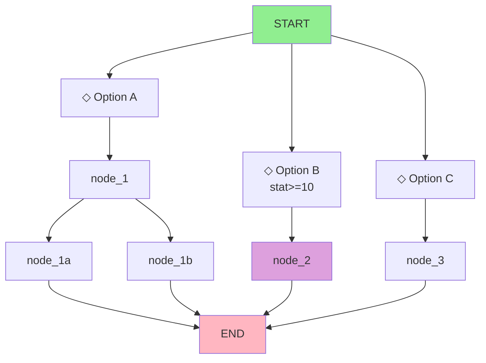

# Dialogue Tree

## Overview

**Conversation:** [Conversation Name/ID]  
**Location:** [Where it takes place]  
**Participants:** [NPCs involved]  
**Version:** [Version]  
**Date:** [Date]  
**Author:** [Author]

---

## Conversation Metadata

| Field | Value |
|-------|-------|
| Conversation ID | |
| NPC | |
| Player Character | |
| Prerequisites | [Quests, flags, stats required] |
| Triggers | [What starts this conversation] |
| Mood | [Friendly, hostile, neutral, etc.] |

---

## Dialogue Flow

### Node Legend

| Symbol | Meaning |
|--------|---------|
| `[START]` | Conversation begins |
| `[END]` | Conversation ends |
| `◇` | Player response option |
| `→` | Leads to |
| `[COND: flag=value]` | Condition required |
| `[EFFECT: flag+=1]` | Effect on exit |

---

## Dialogue Nodes

### Node: START

**Speaker:** [NPC Name]

**Text:**
> [Opening line]

**Responses:**

| ID | Text | Condition | Next Node | Effect |
|----|------|-----------|-----------|--------|
| A | [Response 1] | | node_1 | |
| B | [Response 2] | [COND: stat>=10] | node_2 | |
| C | [Response 3] | | node_3 | |
| [LEAVE] | [Goodbye] | | END | |

---

### Node: node_1

**Speaker:** [NPC Name]

**Text:**
> [Response to option A]

**Emotion:** [Happy, angry, sad, etc.]

**Animation:** [Gesture, expression]

**Responses:**

| ID | Text | Condition | Next Node | Effect |
|----|------|-----------|-----------|--------|
| A1 | | | node_1a | |
| B1 | | | node_1b | |

---

### Node: node_1a

**Speaker:** [NPC Name]

**Text:**
> 

**Responses:**

| ID | Text | Condition | Next Node | Effect |
|----|------|-----------|-----------|--------|
| | | | END | |

---

### Node: node_2

**Speaker:** [NPC Name]

**Text:**
> [Response to option B - special path]

**Condition:** `[COND: stat>=10]`

**Responses:**

| ID | Text | Condition | Next Node | Effect |
|----|------|-----------|-----------|--------|
| | | | | |

---

### Node: node_3

**Speaker:** [NPC Name]

**Text:**
> [Response to option C]

**Responses:**

| ID | Text | Condition | Next Node | Effect |
|----|------|-----------|-----------|--------|
| | | | | |

---

## Branch Summary

```
[START]
   ├── A → node_1 → node_1a → [END]
   │              └→ node_1b → [END]
   ├── B → node_2 → [END]  (requires stat>=10)
   └── C → node_3 → [END]
```

---

## Flags & Effects

### Flags Set

| Flag Name | Type | When Set | Value |
|-----------|------|----------|-------|
| | [bool/int/string] | [On node entry/exit] | |

### Flags Checked

| Flag Name | Condition | Node |
|-----------|-----------|------|
| | | |

---

## Quest Integration

### Quests Started

| Quest ID | Trigger Node |
|----------|--------------|
| | |

### Quests Completed

| Quest ID | Completion Node |
|----------|-----------------|
| | |

### Quest Updates

| Quest ID | Update | Node |
|----------|--------|------|
| | "Talk to merchant" | node_2 |

---

## Relationship Changes

| NPC | Stat | Change | Node |
|-----|------|--------|------|
| | reputation | +5 | node_1a |
| | friendship | +10 | node_2 |
| | romance | +3 | node_3 |

---

## Voice Over

| Node | Line ID | Duration | VO Status |
|------|---------|----------|-----------|
| START | | sec | [ ] Script [ ] Recorded [ ] Implemented |
| node_1 | | sec | [ ] Script [ ] Recorded [ ] Implemented |
| node_1a | | sec | [ ] Script [ ] Recorded [ ] Implemented |

---

## Localization Notes

| Node | Context | Cultural Notes | Translation Difficulty |
|------|---------|----------------|----------------------|
| START | NPC greeting | Use formal address | Easy |

---

## Implementation Checklist

| Task | Status | Notes |
|------|--------|-------|
| Dialogue script written | [ ] | |
| Conditions defined | [ ] | |
| Effects defined | [ ] | |
| Quest integration | [ ] | |
| VO script delivered | [ ] | |
| Implemented in engine | [ ] | |
| Tested all branches | [ ] | |
| Localized | [ ] | |

---

## Visual Diagram (Mermaid)



---

*Template for dialogue tree design. Use for all branching conversations.*
