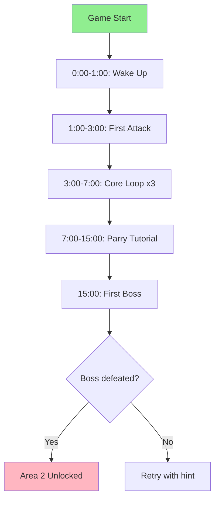

# Example: Tutorial Flow Design Workflow

This example demonstrates how to use `/tutorial-flow` to design a complete
first-time user experience (FTUE) for an action RPG.

## Context

**Game:** "Shadow Blade" — action RPG for PC/console  
**Genre:** Metroidvania with combat focus  
**Goal:** Design engaging tutorial that teaches combat without boring players

---

## Session Transcript

### Step 1: Invoke the Skill

```
/tutorial-flow full
```

### Step 2: Onboarding Strategy

The skill asks about design philosophy:

> **Q:** What's the emotional goal for the first 60 seconds?
>
> **A:** Excitement and curiosity. Players should feel like a ninja already.

> **Q:** Tutorial design philosophy?
>
> **A:** Show, Don't Tell — minimal text, learn by doing.

> **Q:** Failure state design?
>
> **A:** Low punishment. Instant retry. Hints after 3 failures.

### Step 3: FTUE Minute-by-Minute

The skill designs the first 15 minutes:

**0:00 - 1:00 (Hook)**
| Second | Screen | Player Action | Feedback |
|--------|--------|---------------|----------|
| 0-10 | Black screen → fade in | Any input | Controller rumble |
| 10-30 | Character wakes up | Move (L stick) | Footstep audio |
| 30-60 | First enemy appears | Attack prompt | Button highlight |

**1:00 - 3:00 (First Verb)**
- Core verb: **Attack**
- Teaching method: Forced use (enemy blocks path)
- Feedback: Hit pause, screen shake, enemy flash

**3:00 - 7:00 (Core Loop)**
```
See enemy → Dodge → Attack → Collect loot → Repeat
```
- 3 repetitions with increasing difficulty
- Each repetition adds one element

**7:00 - 15:00 (First Complication)**
- New mechanic: **Parry**
- Introduction: Veteran NPC demonstrates
- Player tools: Timing window, visual tell
- Expected outcome: First successful parry

### Step 4: Progressive Learning

The skill creates a dependency tree:

```
Movement → Dodge → Wall Jump → Air Dash
    ↓
Combat → Attack → Parry → Combo → Special
    ↓
Progression → XP → Level Up → Skill Tree
```

**Pacing Schedule:**

| Time | New Mechanic | Practice | Mastery Check |
|------|--------------|----------|---------------|
| 0-5 min | Move, Attack | 3 enemies | Reach first gate |
| 5-10 min | Dodge | Projectile | No damage taken |
| 10-20 min | Parry | Elite enemy | Counter-kill |
| 20-40 min | Combo | Group fight | 5-hit combo |

### Step 5: Hint System

The skill designs contextual hints:

| Trigger | Hint Type | Content |
|---------|-----------|---------|
| First enemy | Introduction | "Press RT to attack" |
| 2 failures | Assistance | "Try dodging first" |
| 30 sec inaction | Nudge | Button pulse |
| 5 failures | Direct | Auto-complete option |

**Escalation Ladder:**
```
Level 1: Subtle visual cue (no text)
Level 2: UI hint appears once
Level 3: Hint repeats
Level 4: NPC verbal hint
Level 5: Direct instruction + input overlay
Level 6: Auto-complete offered
```

### Step 6: Retention Hooks

The skill defines return incentives:

**D1 Hook:**
- Investment: First skill point earned
- Unfinished business: Second area unlocked (gated)
- Scheduled reward: Daily login bonus available

**D7 Hook:**
- Progression milestone: First boss defeated
- Habit formation: Daily challenge active
- Content unlock: New game+ mode

### Step 7: Output Files

The skill creates:

1. `design/gdd/tutorial-design.md` — full design document
2. `design/gdd/tutorial-flow.md` — Mermaid flowchart
3. `design/ui/tutorial-hints/` — hint asset list

---

## Output: tutorial-design.md (excerpt)

```markdown
# Tutorial Design Document

## Onboarding Philosophy
Show, Don't Tell — players learn through environmental
cues and forced mechanics, not text tutorials.

## FTUE Flow

### 0:00 - 1:00: Hook
Player wakes in dark room. First input causes controller
rumble and screen fade. Character stands automatically.

### 1:00 - 3:00: First Verb
Enemy appears blocking exit. Button prompt appears.
First attack triggers hit pause + screen shake.

## Progressive Learning
[Full dependency tree and pacing table]

## Hint System
[6-level escalation ladder]

## Accessibility
- Tutorial skip available after first completion
- Text size: scalable (12pt - 48pt)
- Colorblind mode: symbols + colors
```

---

## Output: tutorial-flow.md (Mermaid diagram)



---

## Next Steps

After running `/tutorial-flow`:

1. **Review with `ux-designer`** — usability validation
2. **Review with `game-designer`** — difficulty curve approval
3. **Review with `accessibility-specialist`** — compliance check
4. **Implement prototype** — `/prototype tutorial-flow`
5. **Playtest** — `/playtest-report` with first-time players

---

## Key Learnings

- **First 60 seconds** set the tone — make them count
- **Show, don't tell** — players ignore text, remember actions
- **Failure is teaching** — design failure states as learning opportunities
- **Progressive complexity** — one mechanic at a time, then combine
- **Accessibility from start** — skip options, scalable text, colorblind modes

---

*This example shows how `/tutorial-flow` creates a complete FTUE design with
minute-by-minute flow, progressive learning schedule, and hint systems.*
